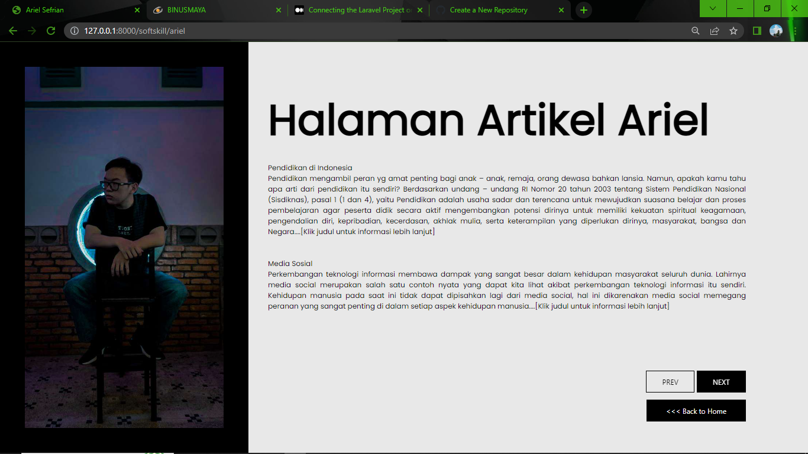
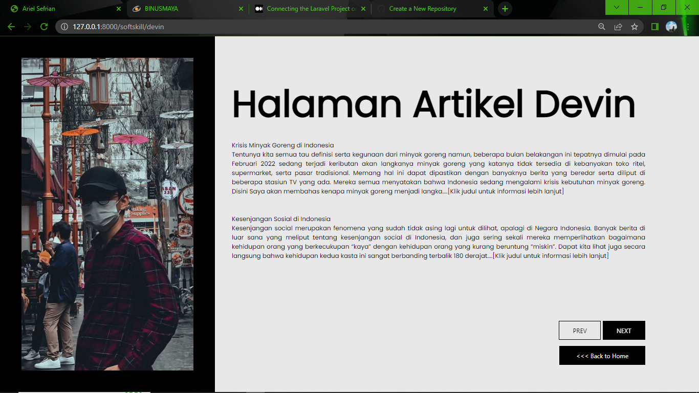
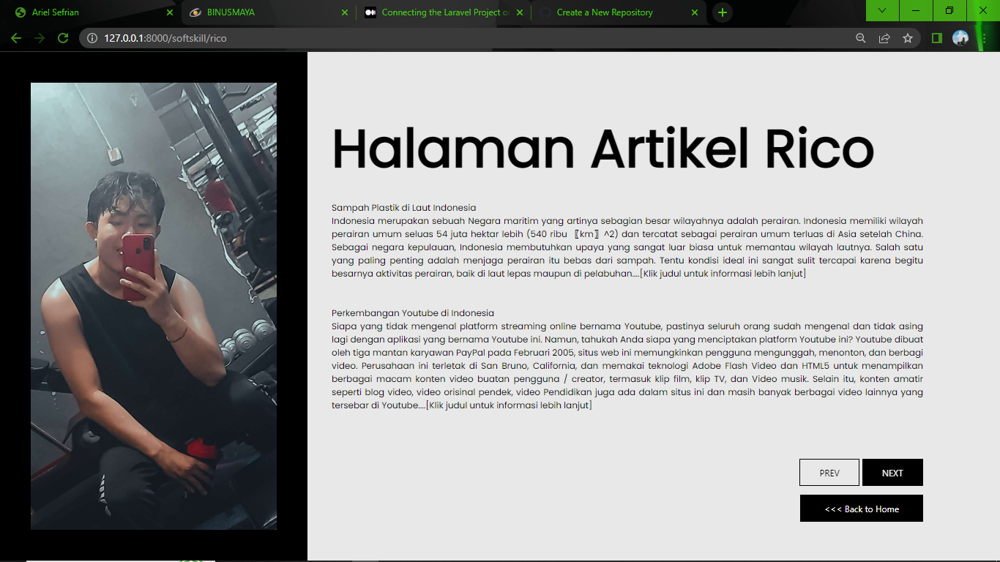
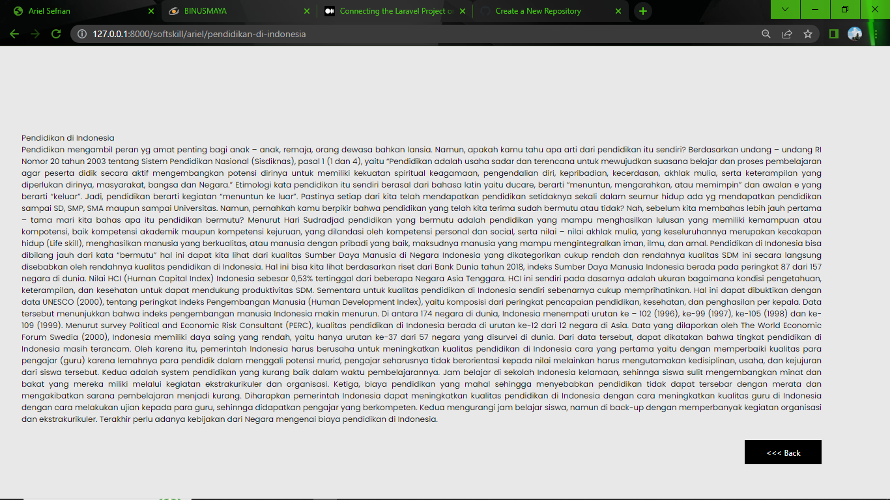

# Tugas Individu

### Anggota:
- 2440114373 - Rico Frenaldi Tokanto

Repository ini melanjutkan tugas kelompok pertemuan sebelumnya, disini saya menambahkan fitur terbaru yaitu Artikel yang telah dibuat. Jadi, disini terdapat folder baru yang bernama layout dan softskill (harusnya bernama artikel tapi saya salah tulis), serta beberapa penambahan di (/routes/web.php). 
- Di dalam folder layout berisi file yang bernama "test.blade.php", nah disini itu berisi template dari page profile sebelumnya (karena terlalu merepotkan untuk di copy paste ke semua file baru di dalam softskill), maka saya berinisiatif untuk melakukan component tag berupa "@yields", kemudian di file yang berada di folder softskill semuanya tinggal "@extends" serta "@section", hal ini agar tidak perlu copas template lagi. Jadi bisa dikatakan kalau ini sebagai parent.
- Di dalam folder softskill terdapat file yang berisi nama anggota, nah itu dianggap sebagai child. Jadi jika ingin memakai template yang sebelumnya telah dibuat di "test.blade.php" bisa di akses dengan @extends('layout.test) nah disini juga dilakukan function foreach
- Penambahan di (routes/web.php) itu berisi statement if dan foreach.

1. Home Page Baru
   

2. Artikel yang telah dibuat Ariel Sefrian
   
   
3. Artikel yang telah dibuat Devin Augustin
   

4. Artikel yang telah dibuat Rico Frenaldi Tokanto
   

5. Rincian Artikel (Isi dari artikel)
   

Repository menggunakan **Tailwind CSS**

Cara untuk menjalankan repository:
1. Jalankan `composer install`
2. Copy file `.env.example`, kemudian paste di folder projectnya dan hapus `.example`, sehingga hanya tersisa `.env`
3. Apabila file `.env` sudah ada, jalankan `php artisan key:generate`
4. Setelah itu jalankan `php artisan cache:clear` dan `php artisan config:clear`
5. Jalankan `npm install`, tunggu sampai selesai install
6. Jalankan `npm run watch-poll`
7. Buka terminal baru, jalankan `php artisan serve`, jadi ada 2 terminal yang menjalankan `npm run watch poll` dan `php artisan serve`
8. Navigasi ke localhost yang digenerate oleh `php artisan serve`

### Note:
Branch yang bisa dipakai (default) adalah branch **Production**, jadi kalau mau download silahkan ke branch Production.

## Copyright
#### @Kelompok 3 - All Rights Reserved
